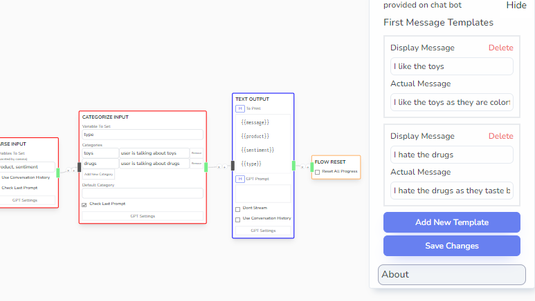
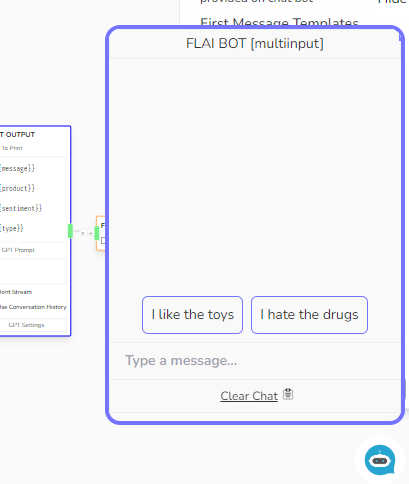
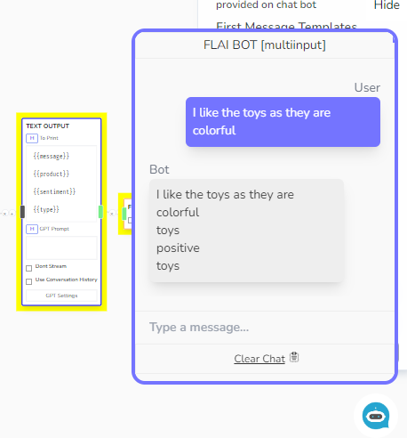

# Chat Starters

You can present the user some Chat Starter topics if they just openned their Chatbot. To do this, you should do the following:

1. Go to the Chatbot Flow Visual Editor

2. On the Sidebar, check the Publish Dropdown

3. You should see a _First Messages Templates_. Click Add New Template and populate it with Chat Starters of your choice.

4. Make sure to save your changes.

As being edited

On the chatbot window

On click of an option

