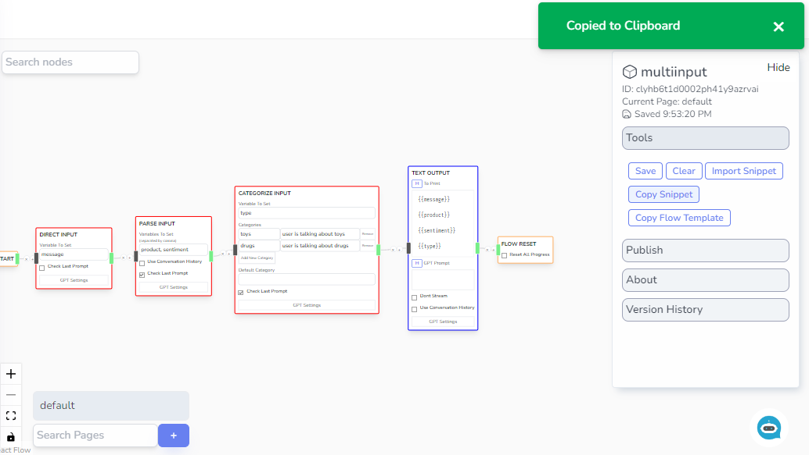
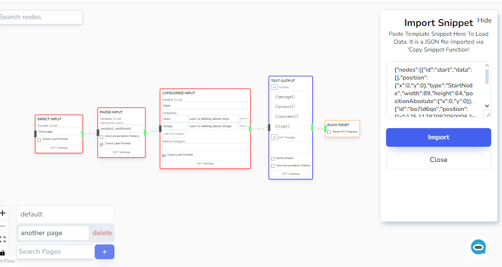
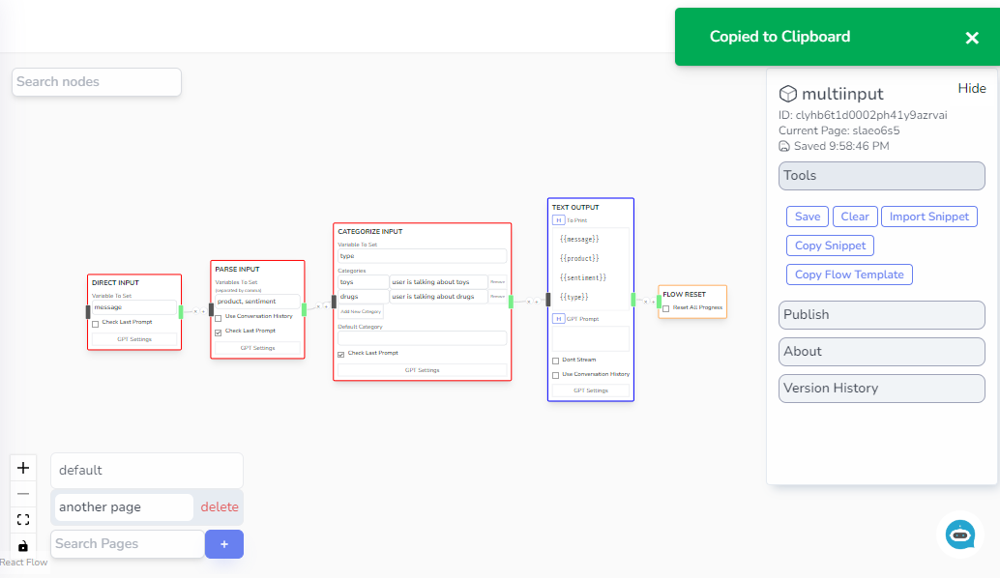
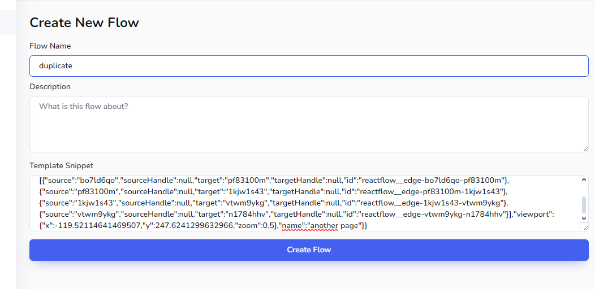
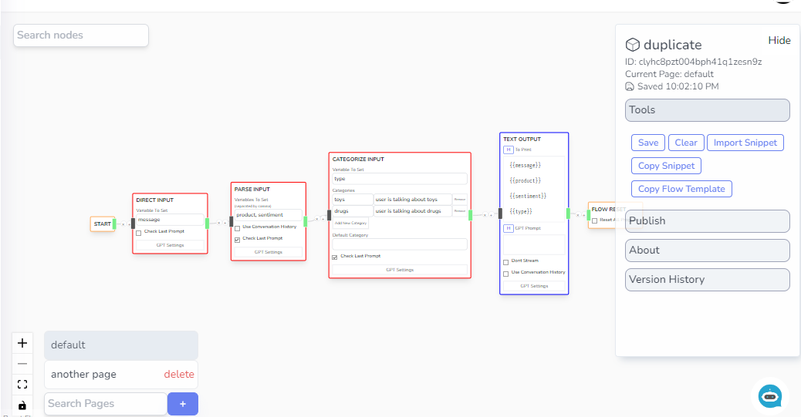

# Flow Copy Pasting

## Snippet Copy Paste

In some cases, you may want to duplicate your current flow page to another page or another project. You can do this by copying the whole flow page by the _Copy Snippet_ button ont the right sidebar of the Visual Editor. Then _Import Snippet_.

Upon clicking of Copy Snippet

On another flow page, you can paste the copied snippet via the _Import Snippet_ command.

:::warning

Note that you cannot copy the _Start Node_, there can only be one Start Node per flow. Use _Flow Portal Start_ node to be able to jump to the newly duplicated node.

:::

## Chatbot Flow Copy Paste

If you want a serialized copy of the whole flow for backup or duplication purpose, you can also copy the whole template by clicking the _Copy Flow Template_ option.

You can then use the copied template when you are creating a new flow by putting the copied snippet into the _Template Snipper Field_

After creation. A duplicate is created

:::warning

With the serialization and parsing methods, you can essentially create a flow by just typing the nodes and connections. But be careful of doing this as buggy template snippets might cause unexpected behaviors to the Visual Flow Editor.

:::
