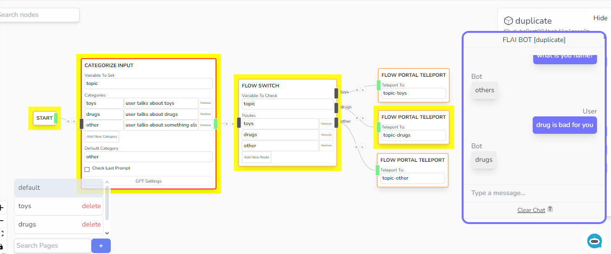

# Multiple Pages

Your logic can span across multiple pages. This is so that you can organize your flow and that you dont cluter a single page.

For example, on the default page, you can categorize the topic:

Then create a page for each topic.

