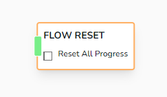

# Flow Reset

Resets the flow progress, providing an option to reset all progress made so far in the flow.

## Parameters

- **Reset All Progress**
  - A checkbox that, when selected, resets all progress in the current flow. If unchecked, this will jump you to "Start Node"

:::note

There's only 1 _Start_ node in the whole flow. Even if you create many pages

:::
