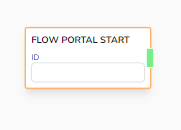

# Flow Portal Start

Creates a new starting point that you can use to jump on when pointed by a [Flow Portal Teleport](/docs/chatbot-builder/nodes/flow-nodes/flow-teleport)

## Parameters

- **ID**

  - Identifier of the Portal. Use this ID to teleport into this when using a _Flow Portal Teleport_

## Example

Use Portal Start Node and Portal Teleport Node to tidy up your logic flow and to be able to utilize Multi Page logic.
