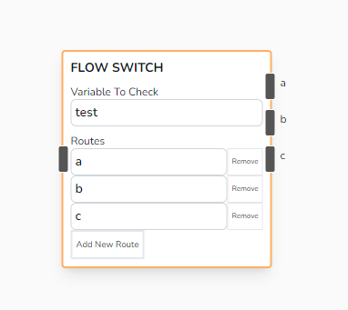

# Flow Switch

Directs the flow based on the value of a specified variable, routing to different branches according to defined conditions.

## Parameters

- **Variable To Check**

  - The variable whose value will be evaluated to determine the route to take. The value of this variable is compared against the defined routes.

- **Routes**
  - A list of possible values that the variable can take, each associated with a specific route or branch in the flow. Note that this only accepts string, note that when expecting to receive numeric values.
