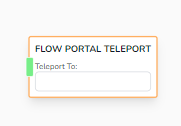
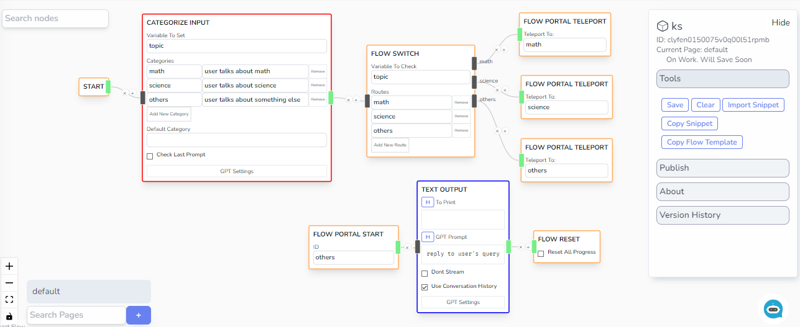

# Flow Portal Teleport

Directs the flow based on the value of a specified variable, routing to different branches according to defined conditions.

## Parameters

- **Teleport To**
  - The ID of the [Flow Portal Start](/docs/chatbot-builder/nodes/flow-nodes/flow-start) that you would like to teleport to.

## Example

Use Portal Start Node and Portal Teleport Node to tidy up your logic flow and to be able to utilize Multi Page logic.
