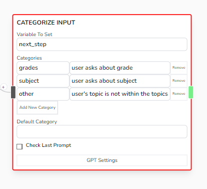
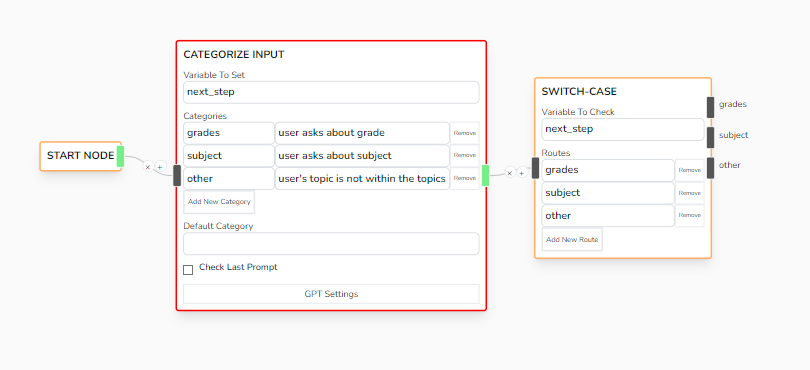

# Categorize Input

Takes the input message of the user as a whole, then categorizes it according to a list of preset categories, then saves the selected category into the provided variable



## Parameters

- **Variable To Set**

  - The location of where to save the selected category

- **Categories**

  - Key and Value pair of possible categories.
    - Example: grades | user asks about grade
    - The next_step variable will be assigned 'grades' if user indeed talks about grades

- **Default Category**

  - For instances that the bot doesn't find any of the category fitting, then it will use the set Default Category

- **Check Last Prompt**

  - Checks if **lastPrompt** has value, if it has value, uses it, else, waits for user's input

## Other Note

### Switch Case

The Categorize Input Node was commonly used in-tandem with **Switch Case** node as they both can redirect user to what specific flow and action the bot should take.



### Prompt

This node uses this prompt to categorize the given input:

```js
var prompt = `
  You will categorize the the following sentence into the correct category 
  ( return a json object in output {category: <number>} ):

   <list_of_categories_here>
`;

return json_object_of_category_key;
```
