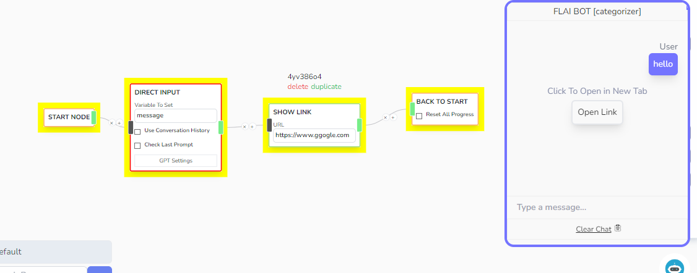

# Link Node

Shows the 'Open Link' button to the user. Clicking on it will open a new tab based of the URL link you provided.

## Parameters

- **URL**
  - The link where the user will be redirected. It can accept handlebar values. Check the **Chat Status** variables on how to use this.
