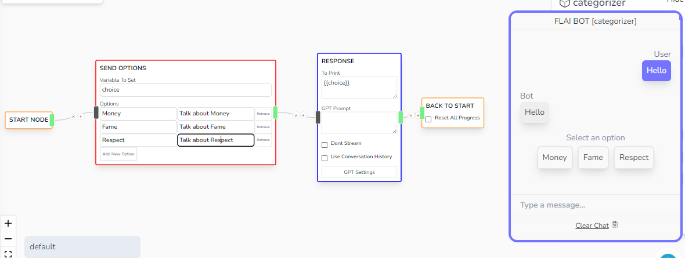

# Options Input

If you want to provide the user a specific set of choices, then you can use this node to send user a list of possible options that they can take.

:::note

However, the user can still send a manual message even if a set of options is offered to them.

:::

## Parameters

- **Variable To Set**

  - The variable to set once the user sends an input.

- **Options**
  - Key Value pair of 'Display Message' and 'Actual Message'
  - The Display Message will be shown on the Option Button.
  - The Actual Message will be sent to the bot if the User picks an option.
  - Both of the message can accept **handlebar** values. Please check Chat Status Object on how to use this
