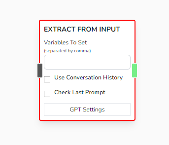
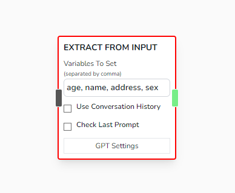
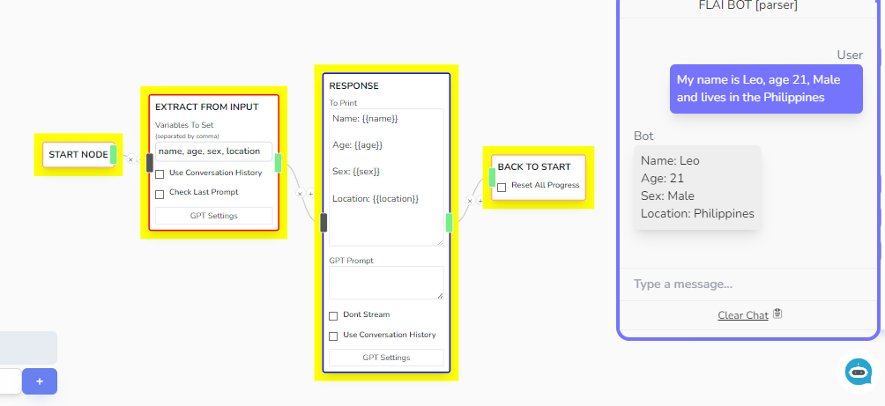
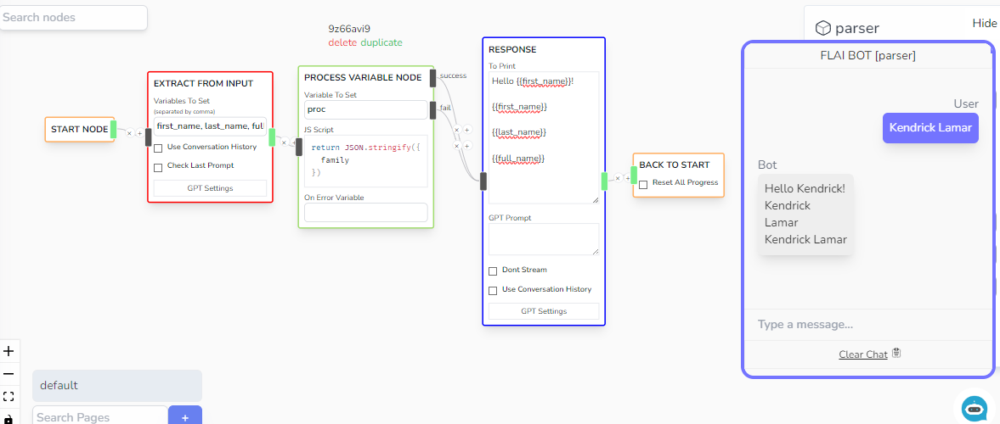
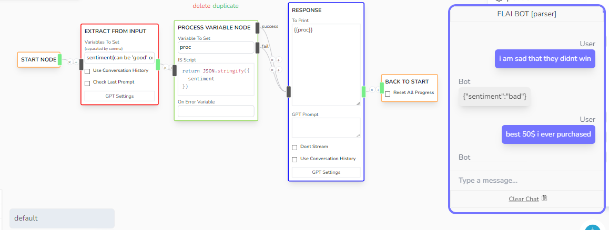
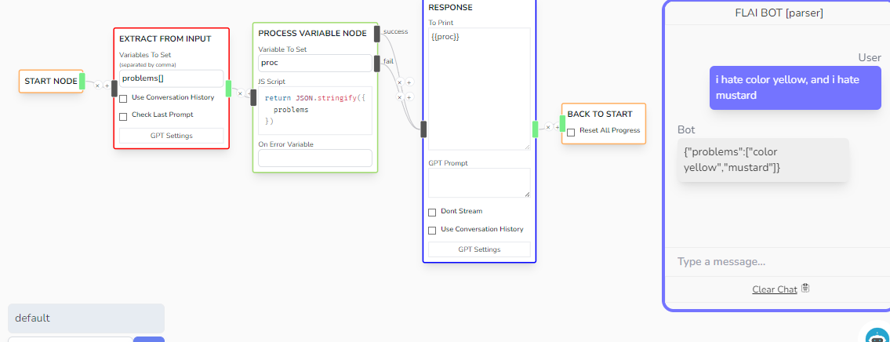
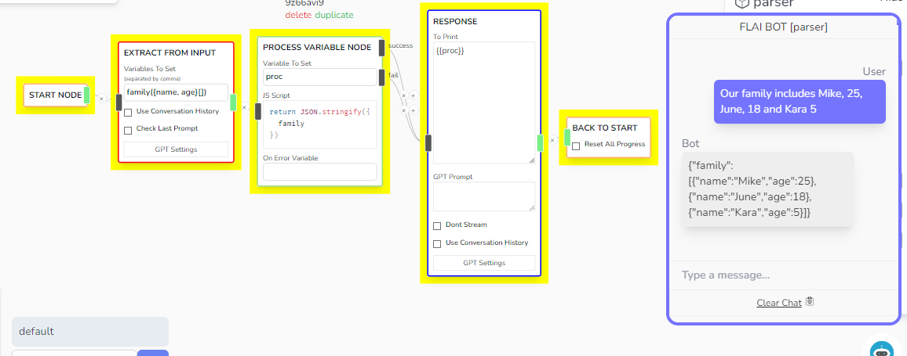

# Parse Answer

Takes the input message of the user and attempts to extract specific values from the message.



## Parameters

- **Variables To Set**

  - Special note: This takes multiple variables.
    
  - It takes a comma separated string where it will attempt to fill in the keys with the appropriate values as provided
    

- **Use Conversation History**

  - (Unstable at the moment)
  - Could be useful if you have a prior conversation and want to attempt to fetch information based of that. Although it would be recommended to use **Parse Conversation Node** instead.

- **Check Last Prompt**
  - Check if **lastPrompt** global variable is set, if it has a value, uses it instead. Else, halts and waits for user input.

## Examples

- You want to take the first_name, last_name and full_name of the user

  - Prompt: `first_name, last_name, full_name`
    

- You want to categorize the user's input based of specific values

  - Prompt: `sentiment(can be 'good' or 'bad')`
    

- You want to take a list of problems

  - Prompt: `problems[]`
    

- Name and age of family members

  - Prompt: `family({name, age}[])`
    

## Other Notes

- As for all AI tools, this uses a prompt, for transparency, this is the prompt used to execute this node:

```txt
You will attempt to fetch the following input from the user's message. Don't use unknown and every field is optional: <your prompt here>.

Return a json object in output { <your_prompt_here> }
```

So it will be formatted like this when you have an input

**Sample 1**

```txt
You will attempt to fetch the following input from the user's message.
Don't use unknown and every field is optional:
first_name, last_name, full_name.

Return a json object in output
{ first_name: string, last_name: string, full_name: string }
```

**Sample 2**

```txt
You will attempt to fetch the following input from the user's message.
Don't use unknown and every field is optional:
family({name, age}[]).

Return a json object in output
family({name: string, age: string}[]).
```

:::warning

Feel free to test this node, however, don't do complex object defnitions as it might result to more random behaviors

:::
