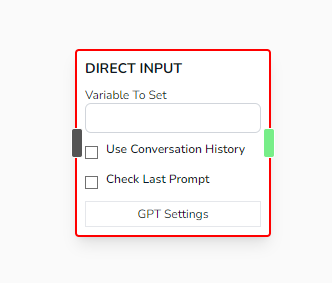

# Save Answer / Input

Waits for user input and saves their answer into the variable set on _Variable To Set_

## Parameters

- **Variable To Set**

  - Name of the variable where you want to save the user input

- **Use Conversation History**

  - (Currently Unused)

- **Check Last Prompt**
  - Checks if the global variable **lastPrompt** is set, if it is set, uses that value. Else, halts and proceeds to wait for a user input.
  - This could be useful if you want to take a single input from before and pass it to multiple Input Nodes.

## Other Notes

- As for all the Input Nodes, the input from this node will be saved to the '**lastPrompt**' global variable.

- This node will only receive string, even if you submitted a number.
