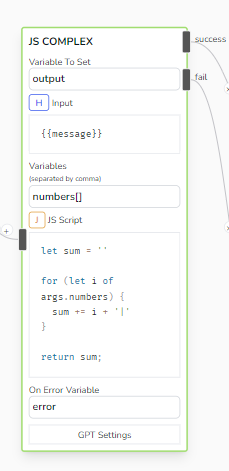
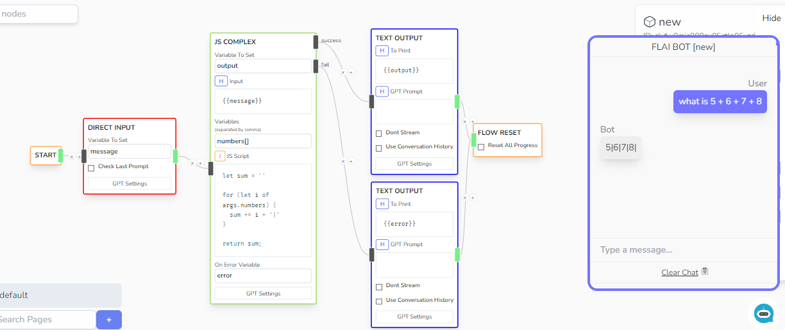

# JS Complex

A more powerful version of JS Processor, but this one takes an input prompt, attempts to extract the variables in the input, then passes it to a JS script to then evaluate it and return the response to the _Variable to Set_ field

## Parameters

- **Variable To Set**

  - Location of where to save the value evaluated by JS Script

- **Input**

  - Input prompt that would be used to extract the variables as provided in the _Variables_ field

- **Variables**

  - A list of variables to extract from the given Input prompt.

- **JS Script**

  - Accepts a JS Script to evaluate. The return value would be saved to the variable defined by _Variable to Set_
  - Uses [safe-eval](https://www.npmjs.com/package/safe-eval) to safely evaluate the script.
  - The _Variables_ defined in the _Variables_ Field can only be accessed in script via the _args_ variable.
  - The _Chat Status_ variables can only be accessed in script via the _state_ variable.

- **On Error Variable**

  - Contains the error message if the evaluator fails

## Sample

