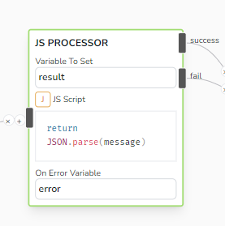
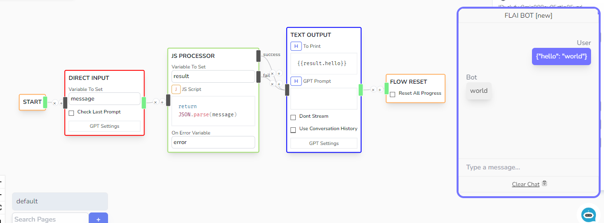

# JS Processor

Evaluates a Javascript code and sets the received retirn value to the defined Variable to Set

## Parameters

- **Variable To Set**

  - Location of where to save the value evaluated by JS Script

- **JS Script**

  - Accepts a JS Script to evaluate. The return value would be saved to the variable defined by _Variable to Set_
  - Uses [safe-eval](https://www.npmjs.com/package/safe-eval) to safely evaluate the script.
  - The _Chat Status_ variables are also accessible globally in script or via the _state_ variable.

- **On Error Variable**

  - Contains the error message if the evaluator fails

## Sample

Sample flow where a raw message was parsed using `JSON.parse` method
