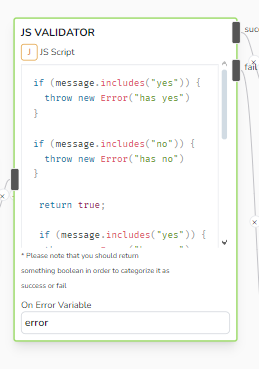
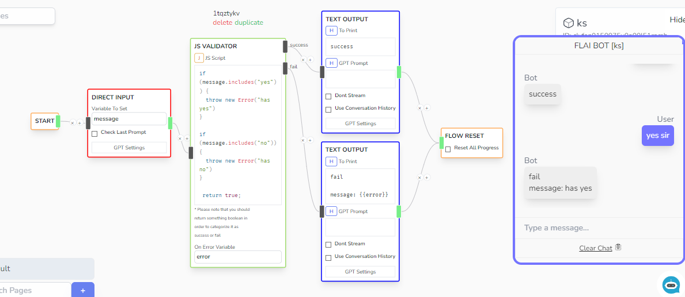

# JS Validator

Evaluates a Javascript code and expects either true, false or an exception to determine the next flow branch.

## Parameters

- **JS Script**

  - Accepts a JS Script to evaluate. If the process return something true-ish, then it will proceed to success branch. Else will return to fail branch.
  - Uses [safe-eval](https://www.npmjs.com/package/safe-eval) to safely evaluate the script.
  - The _Chat Status_ variables are also accessible globally in script or via the _state_ variable.

- **On Error Variable**

  - Contains the error message if the evaluator fails

## Sample

