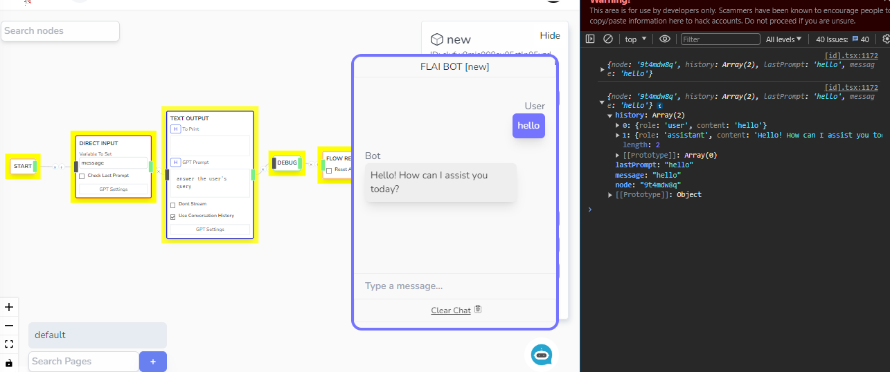

# Debug

Sends the current chat status JSON object. Interceptable if you listened to a stream intercepter. Visible on Visual Chatbot Edito



## Other Note

- Make sure to remove this node if your going to production as this could show sensitive information.

## How To Use Outside of Editor

```ts
// Actual listener with filter
const messageListener = async (data) => {
  if (data.data.type == "debug") {
    try {
      console.log(JSON.parse(data.data.data));
    } catch (error) {}
  }
};

const checkStart = async (args: { retries: number; delay?: number }) => {
  setTimeout(() => {
    if (window["loadWidget"]) {
      window.loadWidget({
        ...fargs.chatData,
        // Here, creates a messageListener on load widget
        messageListener,
      });
    } else {
      checkStart({
        retries: args.retries - 1,
        delay: args.delay,
      });
    }
  }, args.delay ?? 1000);
};

checkStart();
```
