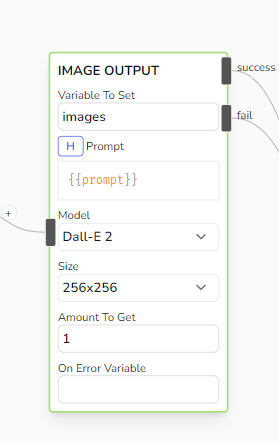
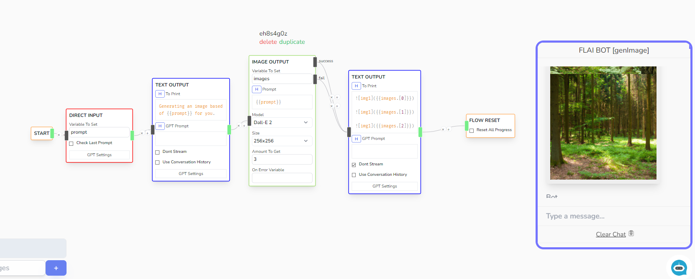

# Image Output

Generates an image using Dall-E using te provided prompt, saves the URL to Variable to Set.



## Parameters

- **Variable To Set**

  - The name of the variable to save the url of the generated images

- **Prompt**

  - Accepts string and Handlebar variables that would be used to generate the image.

- **Model**

  - The Model to generate the image. Can be _Dall-E 3_ or _Dall-E 2_. Default would be _Dall-E 2_

- **Size**

  - The size of the image. _Dall-E 2_ can have sizes of 256x256, 512x512, 1024x1024 pixels while _Dall-E 3_ can have sizes of 1024x1024, 1024x1792 or 1792x1024 pixels. If an invalid size is provided for the model, the image generator would proceed to the _Fail Outcome_

- **Amount to Get**

  - Amount of image to generate. Maximum is 10 for _Dall-E 2_ and 1 for _Dall-E 3_

- **On Error Variable**

  - Accepts the name of the variable on where to save the error messafe if it failed to generate a message

## Outcomes

- **Success**

  - The flow will proceed to the Success Branch if the image generation processes without any error. You can expect the variable mentioned in _Variable to Set_ to contain the image url(s).

- **Fail**

  - If FLAI failed to generate an image due to an exception (content moderation, incorrect input or other errors), then the flow will proceed to this branch. The _On Error Variable_ should contain a json object that describes the error.

## Single vs Multiple Images

### Single Image Response

If you are to generate only a single image then the output would be the actual url string that you can directly embed without looping or any other treatment.

```hbs

```

### Multiple Image Response

If you chose to generate multiple images, then the images output would be in array. To access each of the images, you'll have to access their index or loop through them via the handlebar syntax.



Via Index:

```handlebars


```

Via Loop:

```handlebars
{{#each images}}
  
{{/each}}
```
