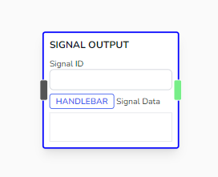
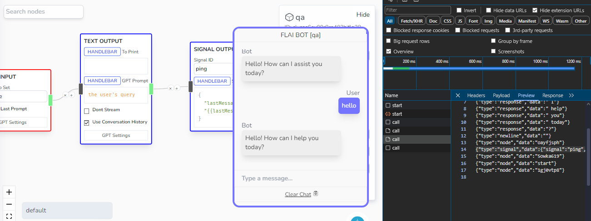
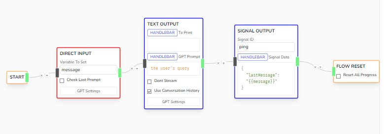
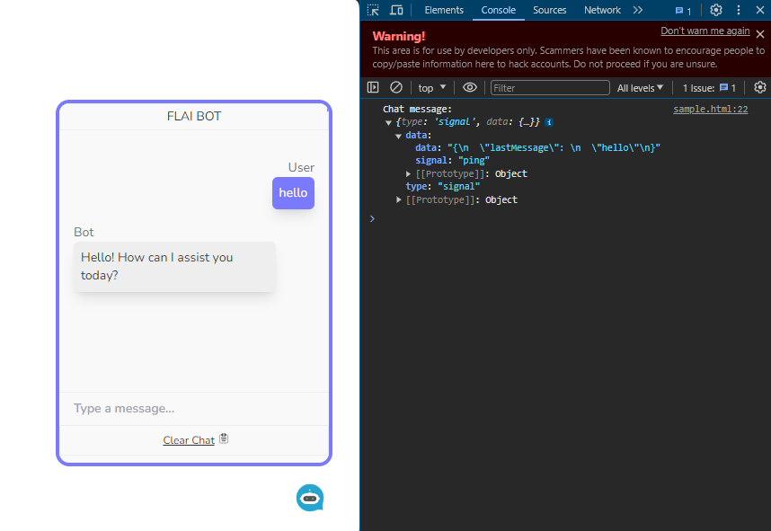

# Signal Output

Sends an interceptable event message from the IFrame that you can use to execute custom action in your page.



## Parameters

- **Signal ID**

  - The ID of the event. Can be used for determining what kind of signal was sent by the chatbot.

- **Signal Data**
  - Metadata information that accompanies the signal ID. It can accept handlebar values. Check the **Chat Status** variables on how to use this.



## Sample

You'll have to create a listener first to the `#chat-iframe` by FLAI. The sample code below shows a bare sample.



```html title="index.html"
<!DOCTYPE html>
<html lang="en">
  <head>
    <meta charset="UTF-8" />
    <meta name="viewport" content="width=device-width, initial-scale=1.0" />
    <title>Document</title>
  </head>

  <body>
    <script src="https://flai-tool.vercel.app/api/embed/widget"></script>
    <script defer>
      function setListener() {
        const childWindow =
          document.getElementById("chat-iframe").contentWindow;
        window.addEventListener("message", (message) => {
          if (message.source !== childWindow) {
            return; // Skip message in this event listener
          }

          if (message.data.type === "signal") {
            console.log("Chat message:", message.data);
          }
        });
      }

      async function checkStart(args) {
        setTimeout(() => {
          if (window["loadWidget"]) {
            window.loadWidget({
              templateID: "clycqs6ey00r8rp402hjflg28",
              userID: "testuser",
              themeColor: "#7a7aff",
              themeDarkColor: "#fff",
              theme2Color: "#eee",
              theme2DarkColor: "#333",
              bgColor: "#f9f9f9",
              darkColor: "#333",
              btnImage:
                'url("https://media.istockphoto.com/id/1010001882/vector/%C3%B0%C3%B0%C2%B5%C3%B1%C3%B0%C3%B1%C3%B1.jpg?s=612x612&w=0&k=20&c=1jeAr9KSx3sG7SKxUPR_j8WPSZq_NIKL0P-MA4F1xRw=")',
              apiKey: "0ffab90f-8a6c-4719-b3f7-25b43db9db9d",
            });
            setListener();
          } else {
            checkStart({
              retries: args.retries - 1,
              delay: args.delay,
            });
          }
        }, args.delay ?? 1000);
      }
      checkStart({
        retries: 5,
      });
    </script>
  </body>
</html>
```


