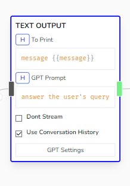

# Text Output

Returns a response to the user that can either be direct text formatted or via ChatGPT Inference, or a mix of both.

## Parameters

- **To Print**

  - Accepts string and Handlebar variables to directly output to the user. Can be left blank if GPT Prompt has an input.

- **GPT Prompt**

  - Takes the input from _To Print_ if available and the Conversation History if enabled then creates a response using ChatGPT. If this is blank, then ChatGPT wont be called and instead, the direct input from _To Print_ will be returned.

- **Dont Stream**

  - Enabling this will return the response without the typing effect. Could be useful when returning an image or a markdown formatted message.

- **Use Conversation History**

  - Gets the conversation history as context when replying with GPT Prompt
