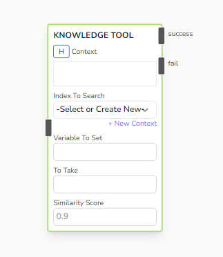
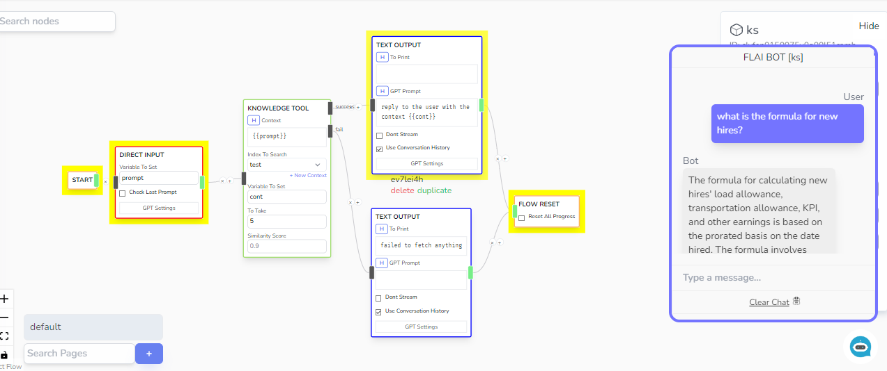

# Knowledge Tool

Searches on your selected Context and saves the context string retrieved into the provided _Variable to Set_. The _Index To Search_ Field gets the org's Context List as available options to use.

To create a new context for use of this node, go [here](/docs/chatbot-flows/create-a-context).

## Parameters

- **Context**

  - The prompt to use when searching for related documents. Can accept handlebar variables.

- **Index To Search**

  - Context Index Collection to search for related documents. Create a new context by clicking the 'New Context' button on the bottom right of the selector.

- **Variable To Set**

  - Destination variable of document string collected from the Context Index. The value saved in this variable would be a concatenated string.

- **To Take**

  - Amount of chunks to take. Each chunk can contain up to 2000 characters. (e.g To Take: 3 would collect 6000 characters as reference.)

- **Similarity Score**

  - Similarity score maximum threshold. Document with lower values would be included as it means that these documents are much more relevant with the prompt provided.

## Outcomes

- **Success**

  - The flow will proceed to the Success Branch if there's a document fetched from the context index. You can expect the variable mentioned in _Variable to Set_ to contain the response data.

- **Fail**

  - If there's an error on Knowledge Search or if there is no relevant document retrieved, the flow will proceed with the _Fail_ branch.

## Sample

