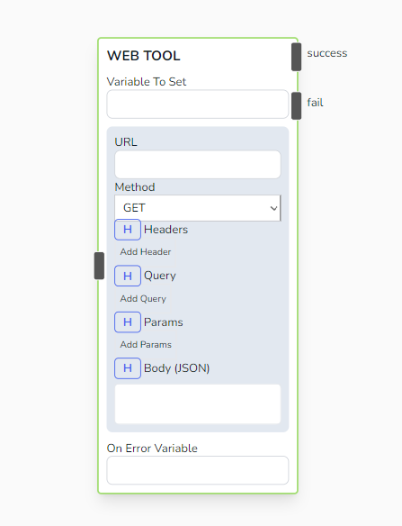
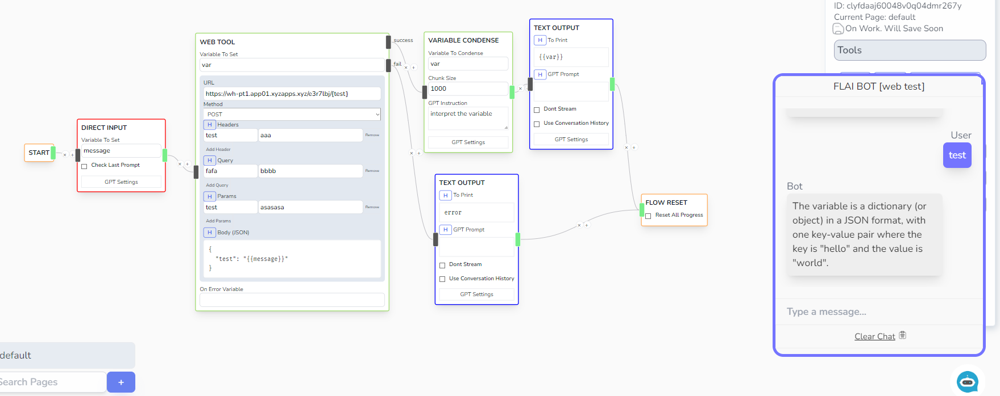

# Web Tool

Sends an JSON HTTP Request to a remote server and saves the response to a variable.



## Parameters

- **Variable To Set**

  - Name of the variable where you want to save the user input

- **URL**

  - URL of the external server to communicate

- **Method**

  - HTTP Method. Can either be GET, POST

- **Headers**

  - List of Headers for the request.

- **Query**

  - List of Query for the request.

- **Params**

  - List of Params. The keys with their values will replace the variable placeholder in the url.
  - Example: If you put `https://www.google.com/{method}`, then put a `method | search` in the Params key-value list. Then the URL will be replaced into `https://www.ggogle.com/search` when processed.

- **Body (JSON)**

  - JSON Request to be sent in the request.

- **On Error Variable**

  - Variable to save when an error message is intercepted while doing the action.

## Outcomes

- **Success**

  - The flow will proceed to the Success Branch if the HTTP request processes without any error. You can expect the variable mentioned in _Variable to Set_ to contain the response data.

- **Fail**

  - If FLAI failed to generate an image due to an exception then the flow will proceed to this branch. The _On Error Variable_ should contain a json object that describes the error.

## Sample

### Sending a Post Request



```js title="Received request by the external server"
{
  "date": 1720587804744,
  "headers": {
    "Accept": ["application/json, text/plain, */*"],
    "Accept-Encoding": ["gzip, compress, deflate, br"],
    "Connection": ["close"],
    "Content-Length": ["15"],
    "Content-Type": ["application/json"],
    "Test": ["aaa"],
    "User-Agent": ["axios/1.7.2"],
    "X-Forwarded-Proto": ["https"]
  },
  "content_length": 15,
  "body": "{\"test\":\"test\"}",
  "method": "POST",
  "path": "/e3r7lbj/asasasa",
  "query": "fafa=bbbb"
}
```
