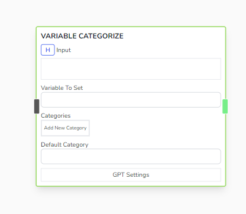
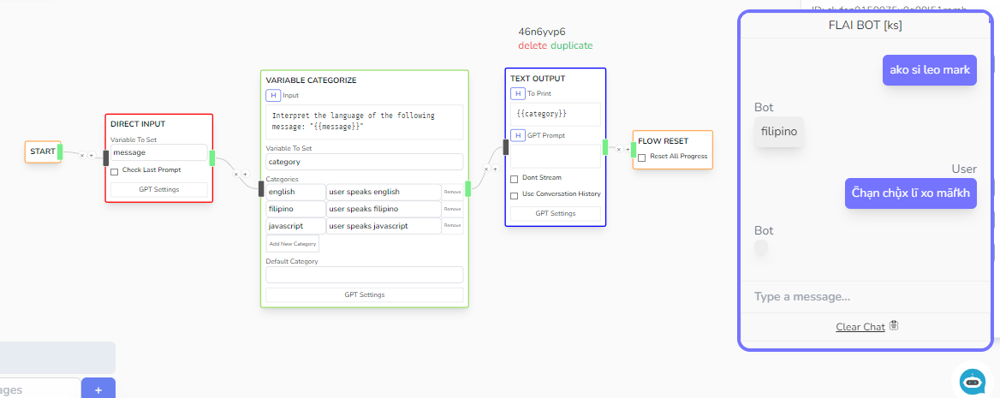

# Variable Categorize

Categorizes the given _Input_ with possible handlebar values, saves the interpretation in a variable. Similar functionality to Categorize Input but this does not halt the flow and instead uses and existing variable value.



## Parameters

- **Input**

  - Input prompt to categorze. Can take Handlebar variables

- **Variable To Set**

  - Location of where to save the categorized input

- **Categories**

  - List of categories to categorize the given input in.

- **Default Category**

  - If GPT for some reason can't categorize the input, then it will use this option instead.

## Other Notes

- Under the hood, FLAI executes the following prompt command in order to get result for this node.

```js
var prompt = `
  You will categorize the the following sentence into the correct category 
  ( return a json object in output {category: <number>} ):

   <list_of_categories_here>

   <input>
`;

return json_object_of_category_key;
```

## Example



Note here that when I tried to speak a translated Thai greeting, it didn't returned any categorization. But returned filipino in my Tagalog (Filipino) greeting.
