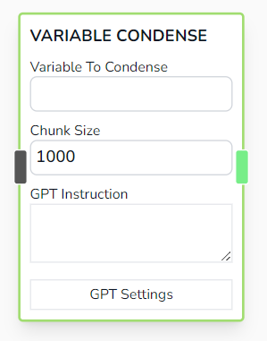
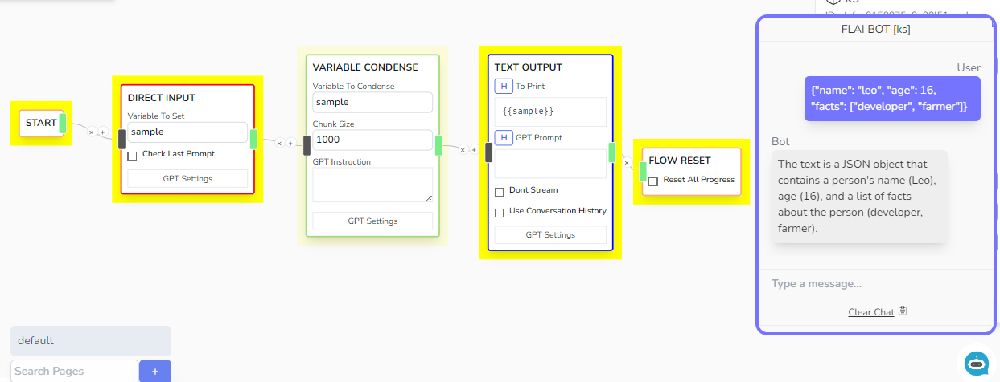

# Variable Condense

Processses the target variable's value using ChatGPT interpretation and overwrites the said target variable with the new interpreted value.



## Parameters

- **Variable To Condense**

  - The variable to process

- **Chunk Size**

  - Used to chunkify large string to help chatgpt overcome the token limit

- **GPT Instruction**

  - The prompt instruction for ChatGPT detailing how to process the information

## Other Notes

- This was useful for when receiving a JSON response and wanting to quickly interpret the value of the JSON.

- Under the hood, FLAI executes the following prompt command in order to get result for this node.

```js
// stringify json object
var originalJSON = JSON.stringify(variable);
// split json to chunks with 1000 words
var jsonSplit = split(originalJSON, 1000);
var summary = [];
for (var split of jsonSplit) {
  summary.push(
    chatGPT(
      `<prompt here or 'summarize the following text'>

        ${split}
      `
    )
  );
}
// merge all summary into one summary
return summary.join("\n");
```

## Example


