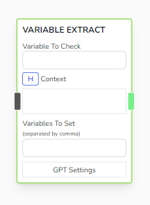
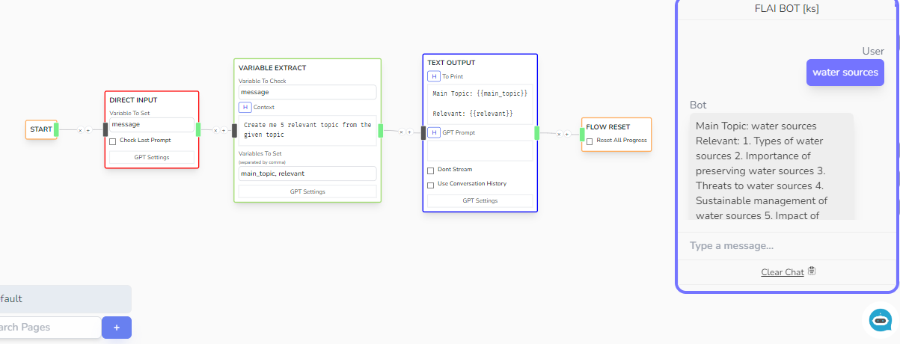

# Variable Extract

Attempts to extract variables from the given variable with the help of the _Context_.



## Parameters

- **Variable To Check**

  - The variable to check and analyze

- **Context**

  - The context of analyzation. Can accept handlebar variables.

- **Variables To Set**

  - The variables to get from the variable and context to check,

## Other Notes

- Under the hood, FLAI executes the following prompt command in order to get result for this node.

```js
var prompt = `
You will attempt to fetch the following input from the user's message. 
Don't use unknown and every field is optional:  <variables>
Return a json object in output {<variables>}

{variable to check value}

<to process>
`;
```

## Example


