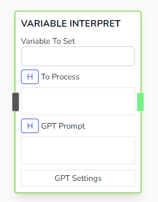
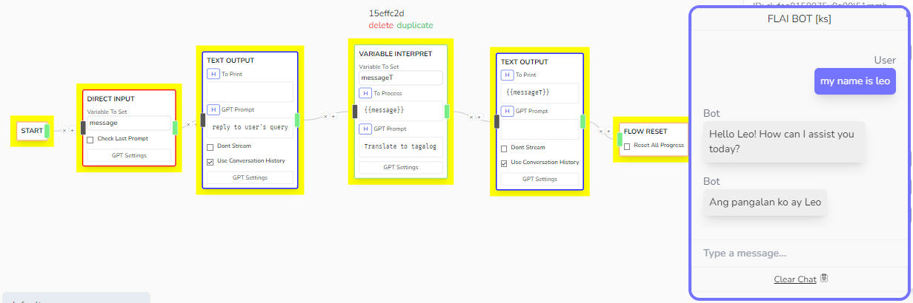

# Variable Interpret

Processes the given _To Process_ text using ChatGPT with GPT Prompt, then saves the interpreted data to _Variable To Set_. Essentially works like _Variable Condense_ but this nodes gives you more flexible input configurations.



## Parameters

- **Variable To Set**

  - The variable to save the interpreted value at

- **To Process**

  - String input that will be interpreted by ChatGPT. Can accept handlebar value.

- **GPT Prompt**

  - The prompt instruction for ChatGPT detailing how to process the information. Can accept handlebar value.

## Other Notes

- Under the hood, FLAI executes the following prompt command in order to get result for this node.

```js
var prompt = `
<gpt prompt>

<to process>
`;
```

## Example


