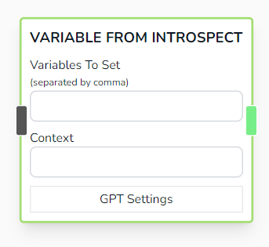
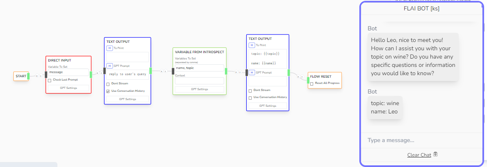

# Variable From Introspect

Attempts to extract the given variables from the conversation history. Can use context to help ChatGPT understand the details of what the variable should look like.



## Parameters

- **Variables To Set**

  - Accepts multiple variables separated by comma. (e.g 'age, preference, name')

- **Context**

  - Helper Context for when attempting to introspect the variables in the conversation history.

## Other Notes

- Under the hood, FLAI executes the following prompt command in order to get result for this node.

```js
var prompt = `
<all_of_conversation_history>

You will attempt to fetch the following variables from the conversation.
<context>
Don't use unknown and every field is optional:
<variables>. Return a json object in output {<variables>}

`;
chatGPT(prompt, { response_format: { type: "json_object" } });
```

## Example


