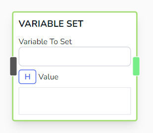

# Variable Set

Directly sets the variable to the provided value.

## Parameters

- **Variable To Set**

  - The variable to set

- **Value**

  - The value to set. Accepts handlebar variables.

## Other Notes

- You can check out _Chat Status Flags_ to set special variables that can affect the overall behavior of the bot.
