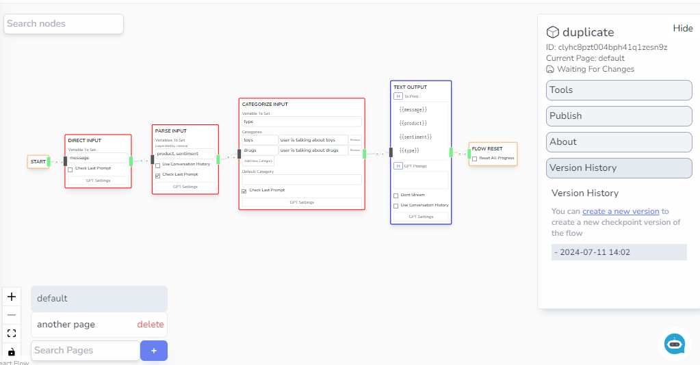
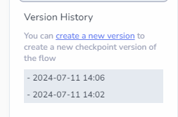
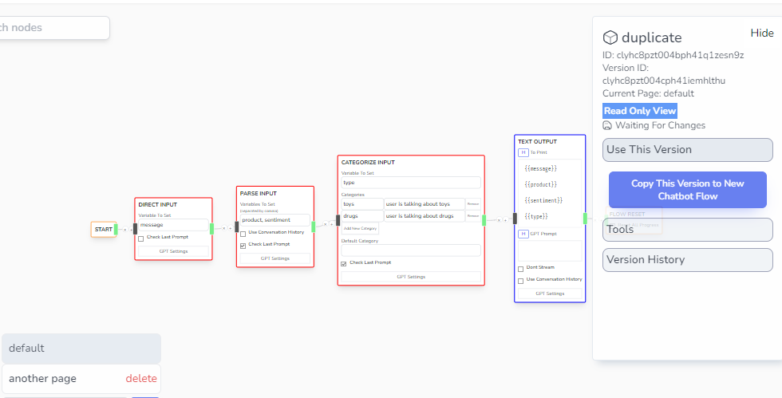
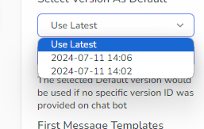

# Versioning

## Creating and Viewing Snapshots

You can create a static version of your chatbot flow by using the Version History section on your right sidebar.

You can see a list of the chatbot versions created along with an option to snapshot the current version.

:::tip

The latest version will always be used when updating the latest changes.

:::

The snapshots are static by design and should not be changeable in the editor. If you visit the snapshot, you will however have an option to duplicate that snapshot into its own project

## Setting a specific snapshot to be the official version

You can select a specific snapshot for public use by going to the Public dropdown and selecting which version would you like to use.

Make sure to _Update_ in order to submit the change.

:::note

Note that **in the flow editor, the latest version will always be used** even if you selected a default version to be used by public. If you want to check this yourself, you can go to the embeddables page and test your publicly created chatbot window.

:::
